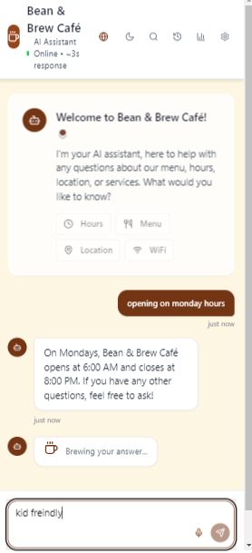
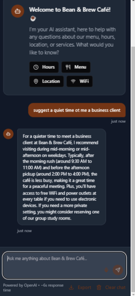

# 🧠 AI Café Chatbot

🌟 A feature-rich, multilingual AI chatbot designed for cafés and small businesses.  
Built with OpenAI, this assistant enhances customer interaction through voice input, smart replies, theme customization, and more.

---

## ✨ Key Features

- ☕ Coffee-themed animations and brewing messages  
- 🌗 Dark mode + theme switching  
- 🌍 Multilingual support (10+ languages)  
- 📊 Analytics dashboard for usage insights  
- 🎤 Voice input for hands-free interaction  
- 💬 Message reactions and feedback system  
- ⏰ Smart time-based quick replies (morning/evening aware)  
- 💎 Glassmorphism UI + enhanced typography  
- ♿ Accessible and mobile-responsive design  

---

## 🚀 Live Demo

👉 [Try the AI Café Chatbot Now](https://6401fa9b-8b2c-4471-9152-f5672d29ec8a-00-3c00vcga3daub.worf.replit.dev/)  
*(Best viewed on desktop or tablet)*

---

## 📸 Screenshots

| Light Mode | Dark Mode |
|------------|-----------|
|  |  |

> _(Upload your screenshots to GitHub with those exact file names)_

---

## 💼 Want This for Your Business?

I can customize and deploy this chatbot for your café, restaurant, or online business.  
Let’s automate your customer engagement in style.

📧 Email: `youremail@example.com`  
🌐 Hire me on Fiverr: [Your Fiverr Link](https://fiverr.com/your-profile)  

---

🛠 Technical Details (for developers)

### 🔧 Built With
- Replit + OpenAI GPT API  
- TypeScript / TSX  
- TanStack Router  
- Tailwind CSS  
- Zustand for state management  
- Framer Motion animations  
- i18next for language support  
- Voice API + LocalStorage

### 📁 Folder Structure
- `app/`: App shell and route layout  
- `components/`: UI elements (chat, nav, toggles)  
- `lib/`: Utility functions  
- `hooks/`: Custom logic  
- `types/`: Type definitions  
- `public/locales/`: Language files  

### 📦 Features (Dev-Level)
- Context-aware GPT prompting  
- Theme persistence with local storage  
- Animated feedback and user response system  
- Smart time-based reply logic  
- Real-time user analytics + dashboard  
- Responsive layout with glass UI  
- Accessibility compliant (WCAG friendly)

---

✅ **Next Step**  
1. Open your GitHub repo  
2. Click `README.md` → ✏️ edit  
3. Replace the current content with this one  
4. Click **Commit changes**

You're done! Your GitHub now looks sharp to clients *and* devs.  
Would you like help uploading the screenshots or demo video next?
